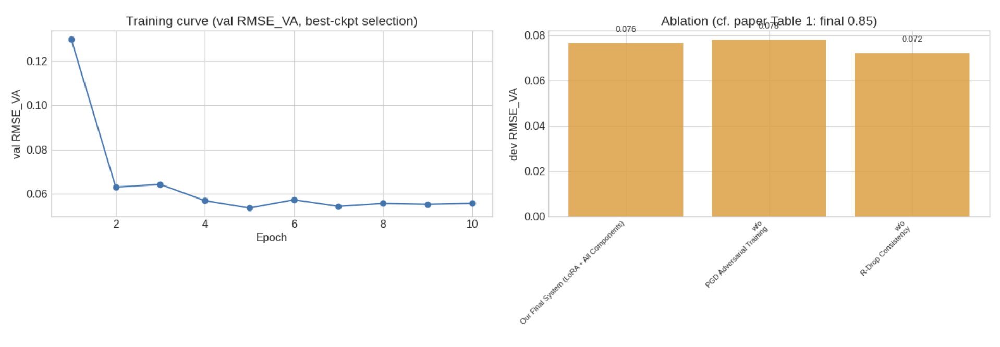

# Phase 1: DimASR (VA 回归) 实验报告

> SemEval 2026 Task 3 - Subtask 1: Dimensional Aspect-Based Sentiment Analysis
>
> **任务**: 给定文本 + Aspect，预测 VA (Valence-Arousal) 分数
>
> **数据集**: zho_restaurant（繁体中文餐厅评论）

---

## 一、任务描述

**输入**: 文本 + 方面词 (Aspect)

**输出**: VA 分数 (Valence, Arousal)

- **Valence (效价)**: 情感的正负倾向，范围 1-9
- **Arousal (唤醒度)**: 情感的强烈程度，范围 1-9

## 二、数据集

### 2.1 数据统计

| 数据集 | 样本数 | 描述 |
|--------|--------|------|
| 训练集 | 6,050 条原始样本 / 8,523 个展开样本 | 使用 `Quadruplet` 字段 |
| 验证集 | 300 条原始样本 / 685 个展开样本 | 使用 `Aspect_VA` 字段 |

### 2.2 VA 分布

| 指标 | 最小值 | 最大值 | 均值 | 标准差 |
|------|--------|--------|------|--------|
| Valence | 1.50 | 8.25 | 5.81 | 0.99 |
| Arousal | 4.00 | 8.25 | 5.76 | 0.65 |

## 三、实验结果

### 3.1 Group A 结果

| 实验 | 方法 | RMSE | 参数量(M) |
|------|------|------|-----------|
| Exp-A1 | RoBERTa-base | ~3.66 | 102.27 |
| Exp-A2 | RoBERTa-base | **~0.54** | 102.27 |
| Exp-A3 | RoBERTa+CNN | ~3.67 | 104.63 |
| Exp-A4 | RoBERTa+LSTM | ~4.99 | 104.37 |

### 3.2 Group B 结果 (PEFT)

| 实验 | 方法 | RMSE | 可训练参数 | 总参数(M) |
|------|------|------|-----------|-----------|
| Exp-B1 | LoRA | 4.9963 | 0.29% | 102.56 |
| Exp-B2 | P-Tuning | **0.7099** | 1.71% | 104.05 |
| Exp-B3 | LoRA+CNN | 4.9963 | 2.53% | 104.93 |
| Exp-B4 | LoRA+LSTM | 4.9963 | 2.29% | 104.67 |

### 3.3 Group C 结果 (快速验证)

| 实验 | 方法 | RMSE | 耗时(分钟) | 可训练参数 |
|------|------|------|-----------|-----------|
| Test-C1 | SFT_LORA | 0.7594 | 10.4 | 0.86% |
| Test-C2 | REGRESSION_LORA | 1.0279 | 2.3 | 0.86% |

### 3.4 消融实验

| ablation | val_rmse_va | dev_rmse_va_calib |
|----------|-------------|-------------------|
| Our Final System (LoRA + All Components) | 0.0587 | 0.0763 |
| w/o PGD Adversarial Training | 0.0598 | 0.0780 |
| w/o R-Drop Consistency | 0.0571 | 0.0721 |

